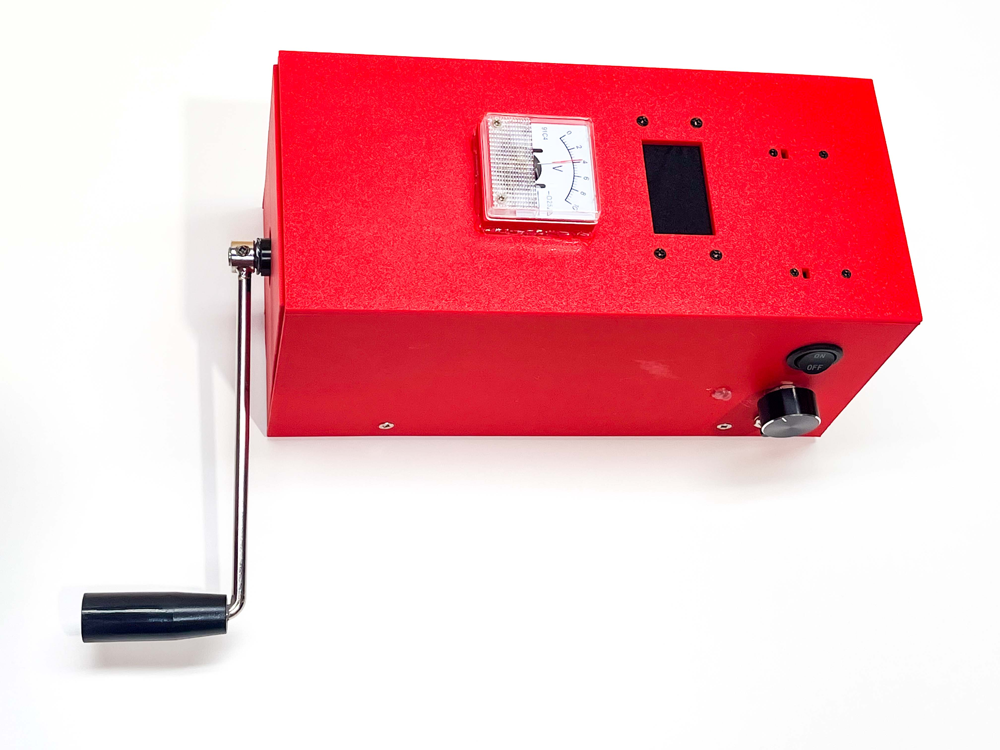

CrankGPT is your fully offline and off-the-grid voice assistant. There's no battery, no Wi-Fi, no cloud — just a hand crank, a Raspberry Pi 5, and a small stack of speech and language models running locally. Turn the crank, ask a question, get an answer ... and the reward of some exercise.

This article walks through how we built it: the hardware, the local voice agent stack, and the engineering required to **make a conversation feel real on a device this small**.

## Why?

Because every voice assistant on the market assumes a wall socket and a data center. CrankGPT is a small argument that neither has to be true. The model is in your hand. The power is in your arm. The latency is in your wrist.

Start cranking.

## Hardware

### Raspberry Pi 5

The brain is a stock Raspberry Pi 5 with 8GB RAM. We chose it for its accessibility and software ecosystem, but as we'll discuss later, an Orange Pi with its faster DDR5 RAM is an even better fit for LLM inference. The Pi runs everything locally on CPU (no accelerators): speech recognition, the language model, and text-to-speech.

### Audio

For audio I/O we use the [KEYESTUDIO ReSpeaker 2-Mic Pi HAT](https://www.amazon.com/dp/B07H3T8SQY): a stereo MEMS mic array with a WM8960 codec. It sits directly on the Pi's GPIO header and gives us decent far-field pickup, while actually being positioned inside the box.

### Power

Power comes from an off-the-shelf [20W hand-crank generator](https://www.amazon.com/dp/B0F52VY4KF) — a consumer product marketed for emergency USB charging. Its native output is 3–15V.

Hand-cranking is naturally bursty, and a Raspberry Pi is notoriously picky about its power input: it will brown out if the voltage falls below 4.9V or exceeds 5.2V. To bridge that gap, we added a small custom board with a bank of capacitors that smoothes the input and acts as a short-term reservoir. It buys us enough headroom to ride out the spikes when the full inference stack kicks in, and lets the user pause cranking for up to 15 seconds at a time.

> *TODO: insert circuit diagram and components list for the board*

You can *feel* that load curve through the crank: when LLM inference and speech synthesis run together, you'll sweat more! Compute becomes a tactile experience.

## Software

### Operating system

The OS is [DietPi](https://dietpi.com/) — a minimalistic, stripped-down Debian-based image. We picked it for fast boot time and for the absence of services we don't need. Turning off unneeded radio services (Bluetooth, Wi-Fi, etc.) reduced boot time even further: from power-on to a usable userspace in around 3 seconds.

### Voice Agent

We wrote our own [edge voice agent](https://github.com/ktomanek/edge_voice_agent) optimized for RPI-class boards. Our motivation for building this from scratch rather than on top of existing frameworks (like e.g. Pipecat): we wanted to understand the system end-to-end, and we wanted minimal dependencies on a device with limited memory. The pipeline is the obvious one — ASR + VAD → LLM → TTS — with every stage is tuned for latency on CPU.

### Speech recognition

[Moonshine](https://github.com/usefulsensors/moonshine) ASR turned out to be [by far the fastest option](https://github.com/ktomanek/captioning#results) for CPU-based ASR. It's slightly less robust in noisy environments (not irrelevant in our scenario) and on accented speech compared to e.g. Whisper base-sized models or Nvidia's FastConformer. But we optimized for low latency given our goal of a real-time voice agent. For endpointing, we use [Silero VAD](https://github.com/snakers4/silero-vad).

### Language model(s)

The LLM runs on [llama.cpp](https://github.com/ggerganov/llama.cpp). Our preferred models are small  [Liquid AI LFM2](https://www.liquid.ai/blog/liquid-foundation-models-v2-our-second-series-of-generative-ai-models) variants (e.g. 350M or 1.2B), along with [Gemma 3](https://deepmind.google/models/gemma/gemma-3/) in its 1B form .

Measured using llama.cpp (`llama-bench` with pp512 and tg128, 4 threads each, we get these numbers on a Raspberry Pi 5:

| model | quant | memory | prefill t/s | gen t/s | 
| ----- | ----- | -----  | -----  | ----- |
| lfm2.5 350M |  Q4_K_M | 354.48 MiB | 222.65 ± 1.09 | 48.86 ± 0.02 |
| lfm2.5 1.2B |  Q4_K_M | 762.49 MiB | 71.31 ± 0.04 | 15.01 ± 0.01 |
| gemma3 1B |  Q4_K_M | 762.49 MiB | 46.12 ± 0.01 | 14.31 ± 0.01 |

With autoregressive decoding, token generation is the biggest bottleneck of the whole system, and the step most constrained by memory bandwidth -- and not raw compute. This shows clearly when comparing the prefill and generation rates on a Raspberry Pi 5 (DDR4 RAM) versus an Orange Pi 5 Pro (DDR5 RAM):

| model | quant | memory | prefill t/s | gen t/s | gen speedup |
| ----- | ----- | -----  | -----  | ----- | ----- |
| lfm2.5 350M |  Q4_K_M | 354.48 MiB | 221.46 ± 0.27 | 73.03 ± 2.34 | **+49%** |
| lfm2.5 1.2B |  Q4_K_M | 762.49 MiB | 67.68 ± 0.99 | 23.79 ± 0.20 | **+58%** |
| gemma3 1B |  Q4_K_M | 762.49 MiB | 39.47 ± 0.30 | 18.43 ± 0.58 | **+29%** |

Generation rates on the Orange Pi 5 Pro are 29-58% higher, mainly due to the significantly higher memory bandwidth of DDR 5 (Note: on the Orange Pi 5 Pro we restricted execution to the 4 performance cores for a fair comparison). 

Most larger LLMs — even those marketed as `edge-optimized` — are way to slow on either platform to be useful in a real-time voice agent. Token generation rates of well below 10 tok/sec (e.g. Qwen 3.5 2B at 7.8 tok/sec) lead lead to response times with much too high latency.

### Text-to-speech

There's a growing list of good-sounding, CPU-runnable voice models, but most simply don't run in real-time on a Raspberry Pi. [Kokoro](https://github.com/hexgrad/kokoro), [KittenML](https://github.com/KittenML/KittenTTS), [PocketTTS](https://huggingface.co/kyutai/pocket-tts) and [Piper](https://github.com/OHF-Voice/piper1-gpl) are the likely contenders for low-resource edge inference. Piper wins by a large margin on latency and generation speed. [Concretely](https://github.com/ktomanek/edge_tts_comparison#non-streaming), on a Raspberry Pi 5, Piper synthesizes our 20-word test utterance in about 0.50s, while Kokoro is about 9× slower. PocketTTS does support streaming, which significantly reduces time-to-first-byte, but [its RTF is still above 1.0 on a Raspberry Pi causing audible stuttering](https://github.com/ktomanek/edge_tts_comparison#streaming). 

Piper's headroom is what lets it keep up with streaming LLM output in a real conversation — the others just can't.

We stream the LLM's output sentence-by-sentence into Piper. To avoid pauses during playback, we cap the maximum sentence length — and we cap it more aggressively for the *first* sentence. That gets speech started as fast as possible without forcing the model to pre-commit to a short answer overall. The user hears the first words quickly, and the model keeps generating in the background while playback catches up.

### Runtime

All components run on ONNX Runtime, PyTorch dependencies (lingering in some components while not technically required) were removed, to safe RAM but also import time at startup.

## Putting it together

### Startup Time

From the moment you start cranking to the moment CrankGPT can answer is about 30 seconds. Startup time includes:

- **~10–15s** — Pi 5 cold boot through full firmware sequence
- **~3s** — Linux boot to userspace (DietPi)
- **10-15s** — Voice Agent startup (python imports, loading model weights)

Even with all the obvious optimizations — BOOT_DELAY=0, splash disabled, unused boot sources removed, fastest available SD card — the Pi 5's pre-Linux stage still costs us ~10–15 seconds. Unlike the Pi 4, the Pi 5 runs a much more PC-like firmware sequence (PMIC ramp, RP1 init, PCIe/USB enumeration via the EEPROM bootloader) before it ever loads a kernel, and that floor is hard to break through from userland. And unfortunately, Pi 5 doesn't allow for a sleep mode/DRAM preservation.

During voice agent startup, the noticeably slow part is actually Python imports on first run. We tried the obvious fixes and none of them helped meaningfully. Precompiling bytecode (`compileall`) was a no-op — Python already caches `.pyc` files automatically, so there was nothing left to compile on a warm install. Lazy imports trimmed a few hundred milliseconds at best; the bulk of cold-start time isn't in our code, it's in `dlopen`-ing large shared libraries (ONNX Runtime in particular) and in hundreds of small random reads off the SD card as Python walks the import graph. Warming the page cache after boot helped only marginally — because for the first invocation the page cache *is* cold by definition.

NVMe was the most surprising dead end. Faster random reads should have been a clear win, but on the Pi 5 the EEPROM bootloader has to enumerate PCIe and load the NVMe controller's firmware before it can boot, adding roughly 10 seconds to the pre-Linux stage. We gained at runtime what we lost at boot, and then some. For our use case — cold start every session — SD card ended up being faster end-to-end.

To reduce startup time further, dropping the Python layer and replacing the agent glue with a C (or Rust) version could probably save another ~5s of startup time.

### Latency Measurements

Our goal was to build a fully offline and off-the-grid voice agent that allows for smooth, real-time conversations without long wait times (often seen in demonstrations of local voice agents). As described above, the choice of LLM (and their respective token generation rate) is what mostly drives the time-to-first-byte (TTFB) the user perceives. Below are some measurements from a typical conversation, averaging TTFB across all turns:

| LLM used              | TTFB  |
| --------------------- | ------- |
| Gemma3 1b             | ~2.9 sec |
| LFM2.5 1.2b           | ~1.5 sec|
| LFM2.5 350m           | ~0.8 sec|

### Practical Power Needs

Power draw of CrankGPT really depends on the amount of AI inference running. Voltage stays at roughly 5V across the board — the Pi is picky about its supply rail and the cap-bank regulator keeps it pinned there — so the interesting variable is current. We have observed brief current peaks of up to 5V under maximum load. Here are a few common scenarios:

| Scenario                      | Voltage | Current | Power  |
| ---------------------         | ------- | ------- | ------ |
| Idle (just keep the Pi alive) | ~5 V    | ~0.8 A  | ~4 W   |
| ASR (Moonshine)       | ~5 V  | ~1.6 A  | ~8 W   |
| LLM + TTS inference   | ~5 V  | ~3 A    | ~15 W  |

## Happy Cranking

