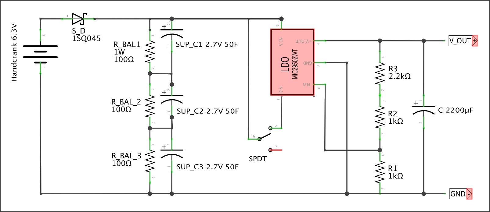

{: .highlight-orange }
> CrankGPT is a fully offline, off-the-grid AI box.

<video src="assets/handcrank_demo.mp4" controls playsinline preload="metadata"
       poster="assets/handcrank_demo_poster.jpg"
       aria-label="A walkthrough video of CrankGPT in action: cranking the generator, asking a question, and hearing a response.">
</video>

Our current demos are variations on voice assistants—turn the crank, say something, get a response—but we've generated images (small), made poetry (bad), and written code using the same setup. There's no battery or cloud. Just a hand crank, a little computer, and a small stack of speech and language models running locally. Provided the electronics are kept dry and at a reasonable temperature, there's no reason this thing won't still work in a hundred years, though you'll definitely need a fresh SD card.

As will be familiar to anyone who has ever undertaken a hardware project, it took about a week to build a proof of concept and many months of kernel optimizations, board revisions, code refactors, and CAD tweaks to get to a thing that works as we envisioned. This article walks through how we built it: the hardware, the local voice agent stack, and the engineering required to **make a conversation feel real on a device this small**.

## Motivation

1. For something to have "smarts" currently assumes a wall socket and a data center. CrankGPT is a small argument that neither has to be true.
2. Local models are private models. Why give away what we don't have to?
3. It offended our European small-practical-car sensibilities to see people around us throwing kilowatts and thousands of tokens at tasks small models could accomplish just as well as huge ones, for a fraction of the cost and energy.
4. Everyone is busy making things bigger. We figured opportunities abound to make things smaller. 


## Hardware

<image src="assets/xray.jpg" aria-label="A prototype version of CrankGPT housed in a see-through box"></image>

### Single Board Computer

We used a stock Raspberry Pi 5 with 8GB RAM and a cooling fan HAT. There are better performing SBDs for the same price (an Orange Pi with its faster DDR5 RAM is an even better fit for LLM inference as we'll discuss below), but it's hard to beat the Pi's accessibility and software ecosystem. The Pi runs speech recognition, a language model, and text-to-speech locally on CPU (no accelerators).

### Audio

We used the [KEYESTUDIO ReSpeaker 2-Mic Pi HAT](https://www.amazon.com/dp/B07H3T8SQY){:target="_blank"}: an all-in-one audio I/O solution for Pi designed specifically for voice assistants. It includes a stereo MEMS mic array and various audio outputs (we used the older version with the WM8960 codec). It sits directly on the Pi's GPIO headers and has decent far-field mic performance, even within an enclosure.

We also tried various USB sound cards ([this one](https://www.amazon.com/dp/B08R38TXXL){:target="_blank"} worked well) to connect an [external mic](https://www.amazon.com/dp/B08PV5CF1F){:target="_blank"} and [speakers](https://www.amazon.com/dp/B0822Z4LPH){:target="_blank"}.

### Power

We chose a cheap off-the-shelf switchable voltage [20W hand-crank generator](https://www.amazon.com/dp/B0F52VY4KF){:target="_blank"} marketed for emergency USB charging. The Pi normally draws around 1.5A, but when it's working hard (as it does when doing inference on the CPU), its current requirements can increase substantially, causing the generator voltage to sag below the Pi's required 4.8V or even, in the case of a momentary 5A spike, to trigger the generator's internal overcurrent protection and shut off the voltage output entirely, causing the Pi to brown out.

To ensure the Pi sees a steady voltage when the full inference stack kicks in (and to afford crankers a little rest), we built a custom capacitor board to smooth out the generator's output and act as a short-term (~20 second) power reservoir.

{: .highlight-orange }
> **You can *feel* that load curve through the crank: when LLM inference and speech synthesis run together, the crank gets a lot harder to turn.**



| Description | Purpose | Label | Qty. | Source | Unit Price |
|---|---|---|---:|---|---:|
| **DIODE SCHOTTKY 45V 15A R-6** | Keeps current from flowing back into the generator | S_D | 1 | [Digikey](https://www.digikey.com/en/products/detail/smc-diode-solutions/15SQ045/6022444){:target="_blank"} | $1.24 |
| **RESISTOR 100 OHM 5% 1W AXIAL** | Ensure super caps in series charge equally | R_BAL1, R_BAL_2, R_BAL_3 | 3 | [Digikey](https://www.digikey.com/en/products/detail/yageo/RSF100JR-73-100R/9161867){:target="_blank"} | $0.19 |
| **CAPACITOR ALUM 2200UF 20% 10V RADIAL** | Smooths out output when LDO shuts off | C | 1 | [Digikey](https://www.digikey.com/en/products/detail/rubycon/10YXJ2200M10X20/3134009){:target="_blank"} | $0.64 |
| **IC REG LINEAR POS ADJ 5A TO220-5** | Regulates hand crank 6.3V to 5.3V SBCs expect. This is not an elegant solution—it wastes power and only works provided the voltage is high enough, but it doesn't need steady power like a buck converter | LDO | 1 | [Digikey](https://www.digikey.com/en/products/detail/microchip-technology/MIC29502WT/771614){:target="_blank"} | $9.96 |
| **CAPACITOR 50F -20% +50% 2.7V T/H** | Store the power the SBC uses | SUP_C | 3 | [Digikey](https://www.digikey.com/en/products/detail/vishay-beyschlag-draloric-bc-components/MAL222091008E3/7318577){:target="_blank"} | $5.79 |
| **RESISTOR 1K OHM 1% 1/4W AXIAL** | Part of the voltage divider that sets the LDO's output voltage | R1, R2 | 2 | [Digikey](https://www.digikey.com/en/products/detail/yageo/MFR-25FRF52-1K/14891){:target="_blank"} | $0.10 |
| **RESISTOR 2.2K OHM 1% 1/4W AXIAL** | Part of the voltage divider that sets the LDO's output voltage | R3 | 1 | [Digikey](https://www.digikey.com/en/products/detail/yageo/MFR-25FTE52-2K2/9140022){:target="_blank"} | $0.10 |
| **ON/OFF ROUND ROCKER SWITCH 12V** | Connects and disconnects the SBC to allow priming the caps | SPDT | 1 | [Amazon](https://www.amazon.com/dp/B0B67GX6CT){:target="_blank"} | $1.20 |
| **ANALOG VOLTAGE METER** | Useful for seeing how much power is in the caps. Connect to ground and the pre-LDO unregulated voltage ouptut of the caps | Not pictured | 1 | [Amazon](https://www.amazon.com/dp/B0D83MBVDQ){:target="_blank"} | $6.99 |
| **USB C BREAKOUT BOARD** | We use these to connect the generator to the board and the board to the SBC via USB (rather than soldering wires) | Not pictured | 2 | [Amazon](https://www.amazon.com/dp/B0B4J5NJ2Y){:target="_blank"} | $0.75 |

## Software

### Operating system

When you're cranking, every second counts—the minute or so it takes Linux to boot up feels like an eternity. [DietPi](https://dietpi.com/){:target="_blank"} is a minimalistic, stripped-down Debian-based image that prioritizes fast boot time over lots of immediately available default services. It shortened our startup time substantially, and turning off unneeded radio services (Bluetooth, Wi-Fi, etc.) reduced it even further: from Linux boot to a usable userspace in around 3 seconds.

### Voice agent

We wrote our own [edge voice agent](https://github.com/ktomanek/edge_voice_agent){:target="_blank"} optimized for RPI-class boards. Our motivation for building this from scratch rather than on top of existing frameworks (like e.g. Pipecat): we wanted to understand the system end to end and have as few dependencies as possible. The pipeline is the obvious one, with every stage tuned for minimal latency on CPU:
1. Automatic Speech Recogntion (ASR) + Voice Activity Detection (VAD)
2. LLM
3. Text-to-Speech (TTS)

### Speech recognition

[Moonshine](https://github.com/usefulsensors/moonshine){:target="_blank"} ASR turned out to be [by far the fastest option](https://github.com/ktomanek/captioning#results){:target="_blank"} for CPU-based ASR. It's slightly less robust in noisy environments (relevant in our scenario with a noisy crank) or on accented speech compared to Whisper-base-sized models or NVIDIA's FastConformer. But we optimized for low latency given our goal of a real-time voice agent. For endpointing, we use [Silero VAD](https://github.com/snakers4/silero-vad){:target="_blank"}.

### Language model(s)

The LLM runs on [llama.cpp](https://github.com/ggerganov/llama.cpp){:target="_blank"}. Our preferred models are small [Liquid AI LFM2](https://www.liquid.ai/blog/liquid-foundation-models-v2-our-second-series-of-generative-ai-models){:target="_blank"} variants (e.g. 350M or 1.2B), along with [Gemma 3](https://deepmind.google/models/gemma/gemma-3/){:target="_blank"} in its 1B form.

Raspberry Pi 5 performance measured using llama.cpp (`llama-bench` with pp512 and tg128, 4 threads each):

| model | quant | memory | prefill t/s | gen t/s | 
| ----- | ----- | -----  | -----  | ----- |
| lfm2.5 350M |  Q4_K_M | 354.48 MiB | 222.65 ± 1.09 | 48.86 ± 0.02 |
| lfm2.5 1.2B |  Q4_K_M | 762.49 MiB | 71.31 ± 0.04 | 15.01 ± 0.01 |
| gemma3 1B |  Q4_K_M | 762.49 MiB | 46.12 ± 0.01 | 14.31 ± 0.01 |


Token generation is the biggest bottleneck in autoregressive decoding and is most constrained by memory bandwidth (not raw compute). This is clearly visible when comparing the prefill and generation rates on a Raspberry Pi 5 (DDR4 RAM) versus an Orange Pi 5 Pro (DDR5 RAM):

| model | quant | memory | prefill t/s | gen t/s | gen speedup |
| ----- | ----- | -----  | -----  | ----- | ----- |
| lfm2.5 350M |  Q4_K_M | 354.48 MiB | 221.46 ± 0.27 | 73.03 ± 2.34 | **+49%** |
| lfm2.5 1.2B |  Q4_K_M | 762.49 MiB | 67.68 ± 0.99 | 23.79 ± 0.20 | **+58%** |
| gemma3 1B |  Q4_K_M | 762.49 MiB | 39.47 ± 0.30 | 18.43 ± 0.58 | **+29%** |

Generation rates on the Orange Pi 5 Pro are 29-58% higher, mainly due to the significantly higher memory bandwidth of DDR5. 

Most larger LLMs—even those marketed as `edge-optimized`—are way too slow on either platform to be useful in a real-time voice agent. Single-digit token generation rates (e.g. Qwen 3.5 2B at 7.8 tok/sec) lead to response times with latency too high for conversation that feels anywhere close to real time.

### Text-to-speech

There's a growing list of natural-sounding, CPU-runnable voice models, but most simply don't run in real time on a Raspberry Pi. [Kokoro](https:///hexgrad/kokoro){:target="_blank"}, [KittenML](https:///KittenML/KittenTTS){:target="_blank"}, [PocketTTS](https://huggingface.co/kyutai/pocket-tts){:target="_blank"} and [Piper](https:///OHF-Voice/piper1-gpl){:target="_blank"} are the likely contenders for low-resource edge inference. Piper wins by a large margin on latency and generation speed. [Concretely](https:///ktomanek/edge_tts_comparison#non-streaming){:target="_blank"}, on a Raspberry Pi 5, Piper synthesizes our 20-word test utterance in about half a second, while Kokoro is nearly 9× slower. PocketTTS does support streaming, which significantly reduces time-to-first-byte, but [its real-time factor (RTF) is still above 1.0 on a Raspberry Pi causing audible stuttering](https:///ktomanek/edge_tts_comparison#streaming){:target="_blank"}. 

Piper's headroom is what lets it keep up with streaming LLM output in a real conversation. The others just can't.

We stream the LLM's output sentence-by-sentence into Piper. To avoid pauses during playback, we cap the maximum sentence length, and we cap it more aggressively for the *first* sentence. That gets speech started as fast as possible without forcing the model to pre-commit to a short answer overall. The user hears the first words quickly, and the model keeps generating in the background while playback catches up.

### Runtime

All components run on ONNX Runtime. PyTorch dependencies (lingering in some components while not technically required) were removed to save RAM and improve startup time.

## Cost of a Conversation


### Startup Time

It takes about 30 seconds from the moment you start cranking to the moment you're having a conversation with CrankGPT. Startup time includes:

- **~10–15s** — Pi 5 cold boot through full firmware sequence
- **~3s** — Linux boot to userspace (DietPi)
- **~10-15s** — Voice Agent startup (python imports, loading model weights)


Even with all the obvious optimizations—BOOT_DELAY=0, splash disabled, unused boot sources removed, fastest available SD card—the Pi 5's pre-Linux stage still costs us ~10–15 seconds. Unlike the Pi 4, the Pi 5 runs a much more PC-like firmware sequence (PMIC ramp, RP1 init, PCIe/USB enumeration via the EEPROM bootloader) before it ever loads a kernel, and that floor is hard to break through from userland. And unfortunately, Pi 5 doesn't have a sleep mode/DRAM preservation, so every time the voltage drops below its minimum requirements, you have to start from zero.

During voice agent startup, the slowest part are Python imports on first run. We tried the obvious fixes and none of them helped meaningfully. Precompiling bytecode (`compileall`) was a no-op—Python already caches `.pyc` files automatically. Lazy imports trimmed a few hundred milliseconds at best; the bulk of cold-start time isn't in our code, it's in `dlopen`-ing large shared libraries (ONNX Runtime in particular) and in hundreds of small random reads off the SD card as Python walks the import graph. Warming the page cache after boot helped only marginally because for the first invocation the page cache *is* cold by definition.

NVMe was the most surprising dead end. Faster random reads should have been a clear win, but on the Pi 5 the EEPROM bootloader has to enumerate PCIe and load the NVMe controller's firmware before it can boot, adding roughly 10 seconds to the pre-Linux stage. What we gained at runtime, we lost at boot, and then some. For our use case—cold start every session—an SD card ended up being faster end to end.

To reduce startup time further, dropping the Python layer and replacing the agent glue with a C (or Rust) version could probably save another ~5s of startup time. We leave this as an exercise to the reader.


### Latency Measurements

Our goal was to build a fully offline and off-the-grid voice agent that allows for smooth, real-time conversations without the multi-second latencies often seen in demonstrations of local voice agents. As described above, LLM selection (and its respective token generation rate) is the primary driver of the time-to-first-byte (TTFB) the user perceives. Below are some measurements from a typical conversation, averaging TTFB across all turns:

| LLM used              | TTFB  |
| --------------------- | ------- |
| Gemma3 1b             | ~2.9 sec |
| LFM2.5 1.2b           | ~1.5 sec|
| LFM2.5 350m           | ~0.8 sec|


### Practical Power Needs

CrankGPT's power draw really depends on the amount of AI inference running. The Pi is picky about its voltage, which needs to be between 4.8V and 5.3V, so the interesting variable is current. We've observed brief current spikes of up to 5A under maximum load. Here are a few common scenarios:

| Scenario                      | Voltage | Current | Power  |
| ---------------------         | ------- | ------- | ------ |
| Idle (just keep the Pi alive) | ~5 V    | ~0.8 A  | ~4 W   |
| ASR (Moonshine)       | ~5 V  | ~1.6 A  | ~8 W   |
| LLM + TTS inference   | ~5 V  | ~3 A    | ~15 W  |

The crank tells you when inference is running: idle, it spins easily; the moment LLM and TTS fire together, the current climbs and you feel the handle fight back. The cost of a conversation isn't abstract—it's in your arm.

## Build your own!

{: .highlight-orange }
> *We're not manufacturing CrankGPT for sale but we'd love for you to build your own.  Every component you need is described in detail above and openly licensed under permissive terms, we just ask that you credit Squeez Labs as the original inventor when you share publicly.*

This project requires some familiarity with electronics, Linux, and Python. It's a great excuse to get comfortable with them if you aren't already. If you follow our directions, building CrankGPT should cost less than $100 beyond the price of a capable Raspberry Pi board (currently ~$200 for the 8GB version).

First, collect the necessary the hardware (prices are current as of time of writing in the US):

| Manufacturer | Qty. | Description | Source | Unit Price |
|---|---:|---|---|---:|
| Mahugde | 1 | **20W HAND CRANK GENERATOR** | [Amazon](https://www.amazon.com/dp/B0F52VY4KF){:target="_blank"} | $35.99 |
| Raspberry Pi | 1 | **RASPBERRY PI 5 8GB** or any other equivalent single board computer that can run Linux—Jetson Orin Nano, Orange Pi 5, etc. | [Adafruit](https://www.adafruit.com/product/5813){:target="_blank"} | $200.00 |
| Raspberry Pi | 1 | **PI 5 ACTIVE COOLER** (not strictly necessary, but recommended) | [Adafruit](https://www.adafruit.com/product/5815){:target="_blank"} | $13.50 |
| KEYESTUDIO | 1 | **RESPEAKER 2-MIC PI HAT V1.0** or USB soundcard, speaker, and mic as mentioned [above](#audio) | [Amazon](https://www.amazon.com/dp/B07H3T8SQY){:target="_blank"} | $11.99 |
| CQRobot | 1 | **3W 4OHM SPEAKER** | [Amazon](https://www.amazon.com/dp/B0822Z4LPH){:target="_blank"} | $3.99 |

You'll also need:
* A power-smoothing system-either our own [super cap board](#power) or a pass-through USB power bank such as [this one](https://www.amazon.com/Anker-Power-Built-Retractable-USB-C/dp/B0DGKWTQQC){:target="_blank"}. **Note:** using the power bank avoids much of the complexity of a super capacitor bank but it also breaks the direct connection between cranking and powering the Pi. You most likely will not be able to feel much difference in the resistance the crank offers in response to increased or decreased computational load.
* [Optional] An enclosure ([here's ours](https://github.com/squeezlabs/crankgpt_diy/tree/main/cad){:target="_blank"})

Then set up the software:

* Flash a [DietPi](https://dietpi.com/){:target="_blank"} image (their docs cover this well), then drop our [`dietpi.txt`](https://github.com/squeezlabs/crankgpt_diy/tree/main/dietpi/dietpi.txt){:target="_blank"}—tuned for a minimal, offline, fast-booting box—onto the boot partition before first boot; it disables Wi-Fi and sets sensible defaults (you'll want to adjust the static IP / network block to match your own network). Boot your pi with this sd card.
* Once it's booted, ssh into the pi, turn off Bluetooth in `dietpi-config` and enable the soundcard.
* If you're using the KEYESTUDIO ReSpeaker 2-Mic Pi HAT, you'll need the WM8960 driver, which can be a bit fiddly to get working on current kernels. Here's what worked for us, using [HinTak's actively maintained seeed-voicecard fork](https://github.com/HinTak/seeed-voicecard){:target="_blank"} (match the `-b` branch and the `linux-headers` package to your kernel version):

```
git clone -b v6.12 https://github.com/HinTak/seeed-voicecard/
cd seeed-voicecard && bash install.sh
# install matching kernel headers, otherwise the card won't load:
apt install linux-headers-rpi-2712
# then in dietpi-config --> Audio, select: hw:0,0 (seeed2micvoicec ... wm8960-hifi-0)
reboot
```

* Build [llama.cpp](https://github.com/ggml-org/llama.cpp){:target="_blank"} with the Raspberry Pi optimizations:

```
cd /root/dev
apt install -y build-essential cmake git libcurl4-openssl-dev
git clone https://github.com/ggml-org/llama.cpp.git && cd llama.cpp
cmake -B build \
  -DCMAKE_BUILD_TYPE=Release \
  -DGGML_NATIVE=OFF \
  -DGGML_CPU_ARM_ARCH=armv8.2-a+dotprod \
  -DGGML_CPU_KLEIDIAI=ON \
  -DGGML_LLAMAFILE=ON \
  -DGGML_CURL=ON
cmake --build build --config Release -j$(nproc)
```

* Clone our [voice agent](https://github.com/ktomanek/edge_voice_agent){:target="_blank"} into `/root/dev` and follow its installation instructions (including the model download scripts):

```
cd /root/dev
git clone https://github.com/ktomanek/edge_voice_agent.git
```
* Have both the llama.cpp server (serving your chosen LLM) and the voice agent launch on boot via `dietpi-autostart` (Custom script). Our [`startup_script.sh`](https://github.com/squeezlabs/crankgpt_diy/tree/main/dietpi/startup_script.sh){:target="_blank"} does exactly this. Optionally adjust your model paths and copy it to `/var/lib/dietpi/dietpi-autostart/custom.sh`.

The voice agent ships with scripts to get you running with a sensible set of default models, but you can swap any of them out (see the voice agent repo for instructions). It's model-agnostic, so adjust models as your hardware allows. On beefier hardware (e.g. a Jetson rather than a Pi) you can swap in larger models; just know you'll likely need a bigger crank and a modified power board.

## Conclusion

While it's currently impractical to run most sophisticated AI workloads on a Raspberry Pi, our work suggests that there exist a whole class of unexplored AI applications that can run locally on the edge without consuming huge amounts of power. And as models get smaller and more efficient (potentially moving away from autoregressive decoding), the "edge" will migrate from your expensive latest-model iPhone to much smaller and cheaper devices.

<video src="assets/handcrank_intro.mp4" autoplay loop muted playsinline
       poster="pics/IMG_2672.jpg"
       aria-label="CrankGPT, a red metal box with a hand crank, voltmeter and OLED display">
</video>

<section class="closing-cta">
  <h2 class="closing-headline"><a href="mailto:hello@squeezlabs.com" style="color:inherit;text-decoration:none;">Get <span class="accent">cranking.</span></a></h2>
</section>


